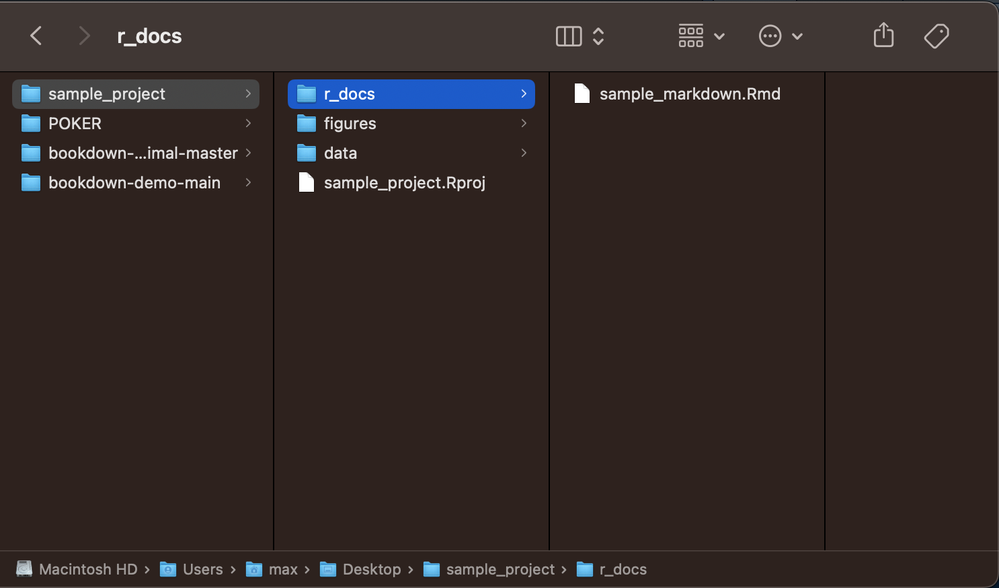
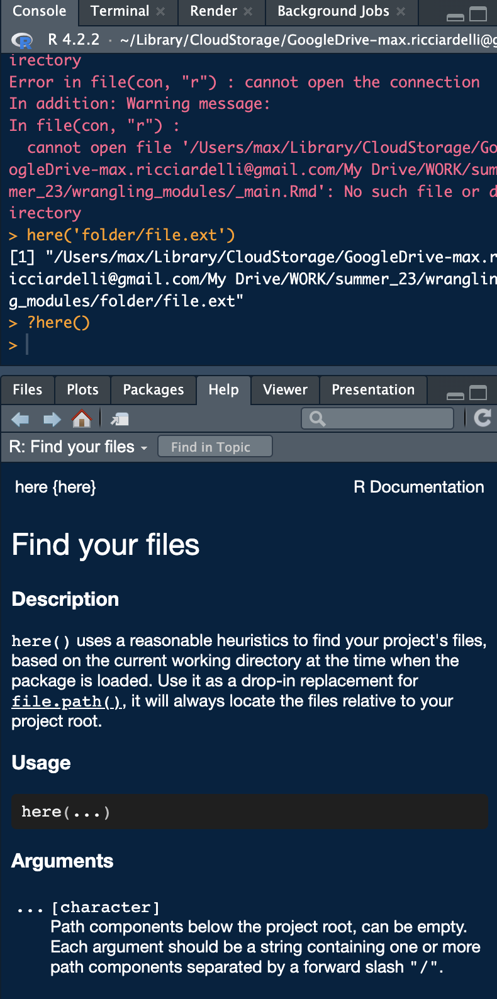
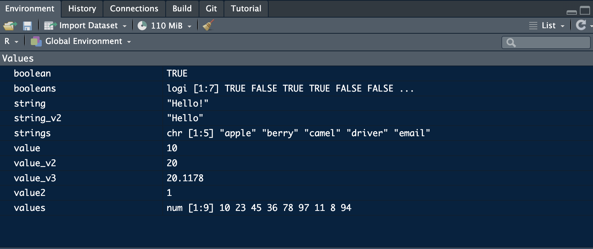

# R and Programming Basics

In this section I will cover the basics of programming. Each programming language has its own intricacies, but the underlying concepts are often the same. I will explain how the basic concepts present in R, offer tips on how to resolve stubborn issues, and suggest helpful resources for exploring R and RStudio. 

R uses projects as the way to save a work space. When you make a new project it creates a folder that holds all of the relevant files for that project. You can hold all files of a type (such as figures) in a folder and then reference them within that folder, allowing for easy access and clear organization. RStudio saves the work space state into the project file (.Rproj), which can be recalled by opening that file. This is really good for preserving workflow when you close RStudio and take a break. Projects are able to link multiple R markdown and other files around the same topic in a coherent way. This can be a wonderful way to take notes in class on a chapter and reference the code from that chapter. In my own classes, I would create a markdown document to take notes on each subject within a chapter allowing for easy reference as I worked to complete assignments. It is also very useful when working on a cohesive assignment with different sections. For example, in my work I often use it to separate the data cleaning process from the data analysis process and data visualization process. By creating separate documents, I am able to run each section independently and the create a more cohesive final document in another R markdown file that contains intentional elements from each. 

This is an example of a sample project I made to illustrate how to organize files:


A few important notes. The names of each folder or file must be easy to reference. To make sure that they are able to be referenced in your code do not use capital letters or spaces, only lowercase letter and underscores. This makes sure that your file is able to be referenced within your markdown document correctly. Additionally, the file names should be consistent and clear to anyone who looks at your project, not just you. 

## Packages, Functions, File Structure, and File Paths

Andy Field, in his tutorial does a good job covering the basics of calling files and the value of the `here()`function.[@andy_field] `here()` is a very useful tool in quickly calling file names and folders without having to type out or copy and paste the name each time. 

### Packages and Functions

Packages are collections of code snippets called functions, usually focused around a central idea or task. For example, the tidyverse package is focused around data manipulation. A function can have parameters that are inputs required for functions to run. Parameters can be all sorts of objects or data types. They can be required or optional. Everything you need to know about a function is contained in its documentation, which can be found on the internet on the [r documentation website](https://www.rdocumentation.org) or be accessed directly in RStudio by typing `?function()` into the console as shown in the screenshot below. 



### Installing and Referencing Packages

The code snippets below shows how to install a package, call it using the `library()` function, and then use a function within a package. I have the installation code commented out as I already have the package installed. To denote a comment within code you use the `#` operator, telling R not to run anything in the line after the `#`. Comments are very important for labeling what you are doing in your code so others can understand what you are trying to do. 

You only need to install a package once and it should be done in the console section instead of in a R markdown file or code chunk. Its important to use the exact syntax shown below. If you do not surround the name of the packages with quotation marks within the parentheses (either `" "`, or `' '`) it will not run. The double or single quotes indicates to R that the text inside is to be read as a string. The main set of packages we will be using during this book are in the tidyverse packages which contains most of the tools we will use for data visualization and manipulation. 

```{r Install Packages}
# install.packages("here")
library(here)
# this is another comment
```

### Calling Functions

This is an example of using the `here()` function to generate a file_name from the working directory, which is displayed after the `library(here)` call above. This function adds the text contained within the here function to the end of the working directory. If you do not want to load the package, as you only need to use it once when importing data, it can be written like this: `here::here()`. `package::function()` allows you to reference a function from a package without having to use `library(package)` function to load in the package. Andy Field does a good job explaining the structure of file paths in the recommended sections from his tutorial. [@andy_field]

```{r Here Function}
here('folder/file.ext')
```

### Changing the Working Directory

The working directory can be changed by using the command `setwd(file_path)`. This is useful when trying to pull files that are not saved within the R project you are working on. This function only changes the working directory for the code chunk it is used in. Below, I use this function to reference my desktop. 

```{r}
setwd('/Users/max/Desktop')
```

## Objects, data, and types

As you are coding in R, you need to save things. To save something you use the assignment operator `<-`. 
There are a few basic categories of individual data types: 

* boolean 
  + booleans are either `TRUE` or `FALSE`
* numeric 
  + numeric values represent some sort of number
  + e.g. `num <- 50`
* string
  + a string of characters
  + e.g. `"Hello!"` or `'Hello!'`

Saving something allows you to refer to it later, or modify it in the future. When dealing with data, it is always good to keep a version of the data as your originally received it and then create new variables for changed versions. 

### Mathematical Operators
R has all the features of a calculator and can perform advanced mathematical operations through functions. Here is a list of all the mathematical operators and their symbols:
`  + addition, - subtraction, * multiplication, / division, ^ exponent `
These are some relevant mathematical functions in base R:
` log() logarithm, log20() log-base-10, cos() cosine, sin() sine`
The `round()` function is useful for rounding numbers to integers. If you specify the number of digits with the `digits = ` parameters you can choose the length of your numbers. If you are trying to do something mathematical there is almost certainly already a function for it. Don't be afraid to look it up. 

This code chunk is an example of how to save each data type and demonstrates the syntax for basic mathematical operations:
```{r Individual Data Types}
boolean <- TRUE # boolean data type
string <- "Hello!"
string_v2 <- 'Hello'
value <- 10 # numeric data type

# spaces aren't necessary but allow for easier reading
value_v2 <- value * 2 # multiplication operator
value_v2 # by printing a variable name on a line of code, R will display it
(value2 <- value / 10) # dividison operator
# if you put parntheses around something when you do it, it prints it as well
value_v3 <- value + (20.5678 - 10.45) 
# addition and subtraction operators as well as the order of operations
value_v4 <- cos(value2) # example of using a function
# this is an example of a function included in "Base R", 
# meaning you do not have to reference a package using library() to use it
value_v3
round(value_v3)
round(value_v3, digits = 2)
```
### Objects
Elements can be combined using the `c()`function to create vectors, which are objects that store variables of the same data type:
```{r}
values <- c(10, 23, 45, 36, 78, 97, 11, 8, 94)
strings <- c('apple', 'berry', 'camel', "driver", "email")
booleans <- c(TRUE, FALSE, TRUE, TRUE, FALSE, FALSE, FALSE)

(mean <- mean(values)) # this shows the use of a function on a set of numeric variables
```

Everything you save will be stored in the environment windown of RStudio and can be viewed by clicking on it:


Objects are a collection of any of these value types or another data structure. They usually have a significance and are integrated with different packages. We will revisit data types later when we talk about ways to store data and the dplyr package. 

## Logical Operators

The logical operators are useful for comparing boolean and numeric variables. These operators can be used in conjunction with loops and if/else statements discussed in subsequent sections. 

### Boolean Operators
These logical operators can be used to compare boolean values (`TRUE` or `False`):

* and `&`
  + both sides of and must be true for and to return true, otherwise it returns false
  
```{r}
TRUE & FALSE
TRUE & TRUE
FALSE & FALSE
```
  
* or `|`
  + if either side is true, this operator returns true

```{r}
TRUE | FALSE
TRUE | TRUE
FALSE | FALSE
```

* equal `==`
  + returns true if the variables are the same
  + can also be used with numeric variables as well as boolean

```{r}
TRUE == TRUE
FALSE == TRUE
50 == 50
51 == 50
```

* not equal `!=`
  + can also be used with numeric variables as well as boolean

```{r}
TRUE != TRUE
FALSE != TRUE
50 != 50
51 != 50
```

### Numeric Operators
These numeric logical operators return (output) a boolean result:

* greater than `>`

```{r}
50 > 51
51 > 50
0 > 0
```

* greater than or equal to `>=`

```{r}
50 >= 51
51 >= 50
0 >= 0
```

* less than `<`

```{r}
50 < 51
51 < 50
0 < 0
```

* less than or equal to `<=`

```{r}
# this can be done with saved values as well
a <- 50
b <- 51
a <= b
b <= a
a <= a
```

`NA` represents a missing value and does not have a type like the examples above. We will discuss errors like this later. 

## If and Else Statements

If and else statements make the execution code conditional on a boolean statement. An if statement only executes the code inside the curly brackets (`{`).

When using the if statement the basic structure is as follows:
`if(boolean statement){code to execute}`
The boolean statement determines if the code to execute runs or not. It is best to space out the bracket and parentheses syntax over multiple lines as demonstrated in the example below, but the syntax must precisely be followed otherwise the code will break.

```{r}
# Lets use the same variables as above
a <- 50
b <- 51

# a <= b evaluates to TRUE 
if (a <= b){
  print("TRUE")
}

# if / else statement example
if (b <= a){
  print("TRUE")
} else{
  print("FALSE")
}
```

You can add an `else` statement after the second curly bracket of the if statement in the same line with its own set of curly brackets. The code within the brackets of the else statement only runs if the above if statement evaluates to false. An example of this is shown in the chunk above and the general form is shown here: `if(boolean){code} else{other code}`

## For and While loops

For and while loops are useful code structures that allow you to repeat sections of code either a set number of times or until the desired result is achieved. Before getting into the specifics of loops, we must discuss indexing in R. Indexing is how the programming language you are using counts. R indexes starting at 1 and going to the final number of the count. There is an example of this in the for loops section below. 

### For Loops
For loops run the code within the loops a certain number of times 

```{r}
for (x in 1:5){ # this loop increases by one each time it runs until x = 5
  print(x) # what you want the loop to do
} # this loop prints the current value of x
```

You can also use for loops to iterate over the items within an object. The code chunk below demonstrates this using a vector of numbers. 

```{r}
obj <- c(1,2,3,4,5,6,7,8,9,10)
for (y in obj){ # each time this loop runs y represents the next item in the vector
  # this loop runs the number of items in the vector (often denoted n)
  y <- y + 10 # this statement adds 10 the current value of y
  print(y) # this statement prints y
}
```

### While Loops
While loops run until the specified parameter is satisfied. You must be careful with while loops, because if the loop parameter is never satisfied in your code the computer will run the loop forever and you will have to stop the code. The code chunk below illustrates how to properly use while loops. 

```{r}
num <- 0
while(num <= 10){ # why does this loop print from 1 to 11 instead of 0 to 10?
  num <- num + 1 # examine the code of the loop line by line as the computer looks at it for debuging
  print(num) # print statements are a useful tool in debuging
  # they help determine where your code breaks
}
```

## Writing your own functions

Writing functions is valuable when you are writing code to do the same thing multiple times. By generalizing the variables of what you are trying to do as parameters in a function, the entire task becomes very easy to replicate. Writing functions also increases your understanding of the processes you are trying to code. The add_ten function shown as an example below shows how to use a parameter and optional parameter to add ten to a numeric variable and then raise it to the power of the optional variable if specified. 

```{r}
# write our own function
add_ten <- function(parameter, optional = 0){ # the optional parameter is zero if not specified
  new <- as.numeric(parameter) + 10 # add ten to the numeric parameter
  # the as.numeric function here solves a type error when knitting
  if (optional != 0){ # if the optional parameter does not equal 0
    new <- new^optional # raise new to the power of the option parameter if included
  }
  return(new) # the return statement ends the function and whats inside the parentheses is the result of the function
}

# if you save a function, it saves what the function returns
(result <- add_ten(10)) # call and run the written function above
# this works without the optional parameter

add_ten(20, optional = 2) # if you use an optional parameter you must set it equal to the name of the parameter

add_ten('10') # this triggers an error becuase you cannot add 10 to a non-numeric variable
# when you encounter an error you do not know the source of look up the error
```

## Additional Resources for Learning R

Many of the concepts discussed in this chapter are under explored, and are meant more as a reference when dealing with the larger process of data wrangling and visualization discussed in this guide. For further help with these topics and a more detailed explanation I recommend consulting *R for Data Science* linked [here](https://r4ds.hadley.nz).[@r4ds] *R for Data Science* aims to cover the basics of R in a longer format and for wider use than this book intends, but fails to fully delve into some of these topics becuase it tries to have such a great breadth. There are many other online, open-access books on different topics within R (e.g. bookdown, R markdown, ggplot2) available at [bookdown.org](https://bookdown.org). Installing `learnr` package will enable tutorials within R studio for a variety of useful things. You can access this through the environment window in RStudio. If you run into any problems using a function the first thing you should look at is the documentation for that function. The documentation will outline all of the required parameters, optional parameters, and examples for how to use the function. After discussing the most basic tools of programming at a glance in this chapter, I will discuss the use of the tidyverse to import, wrangle (clean), and analyze data through a coherent workflow. 
