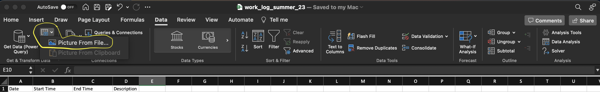
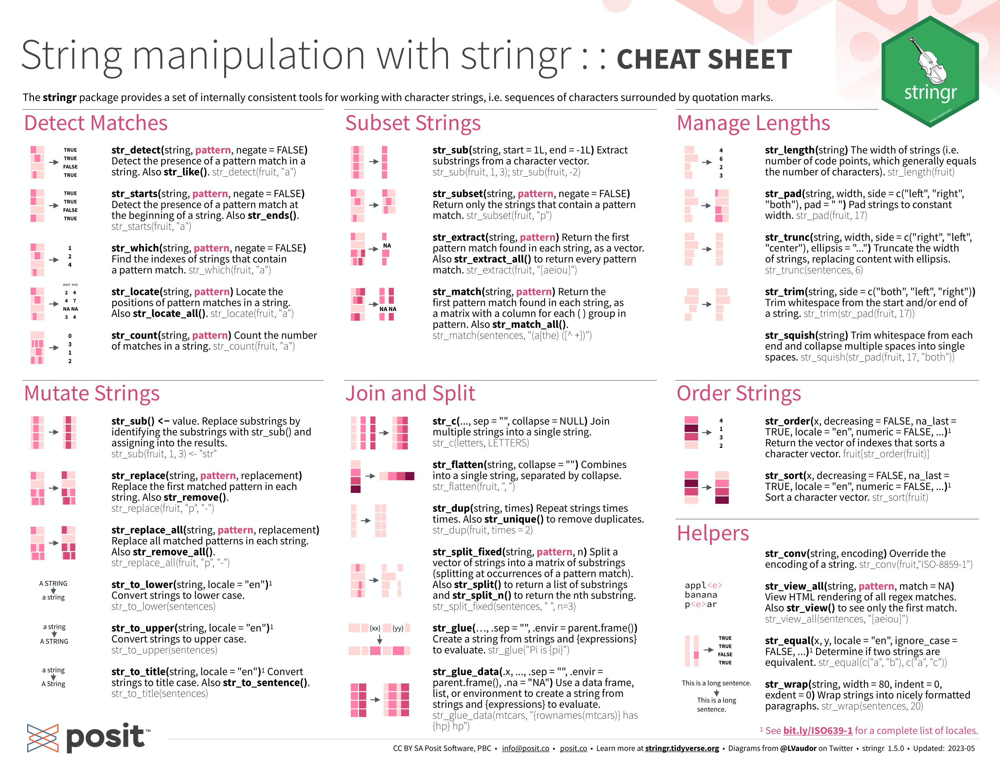
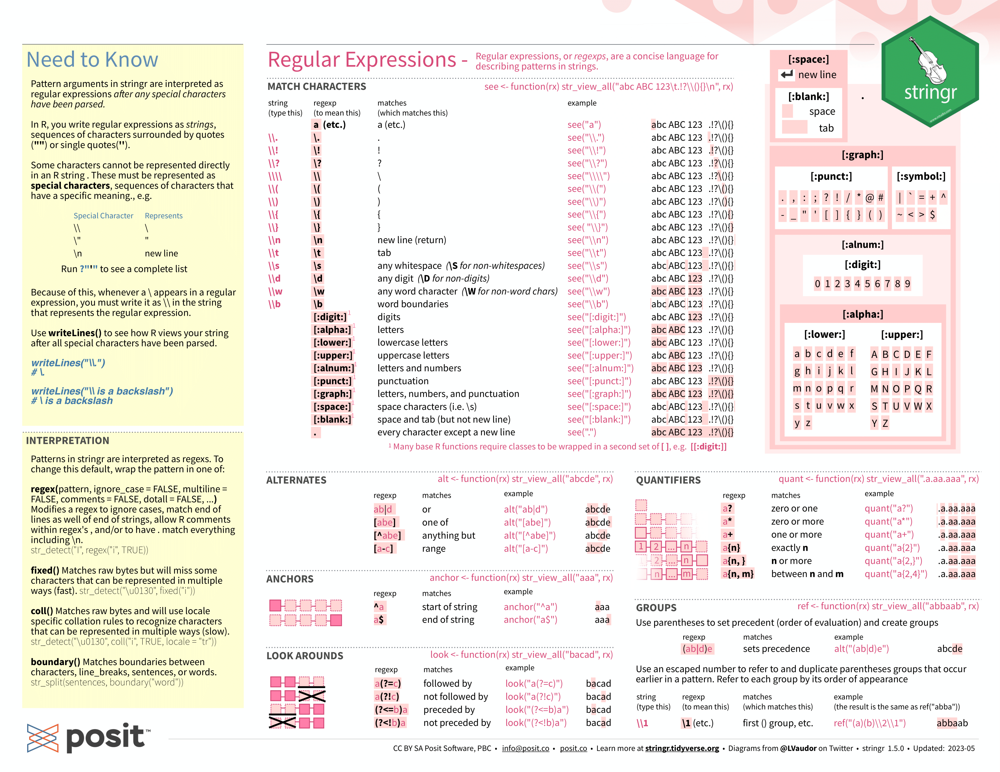
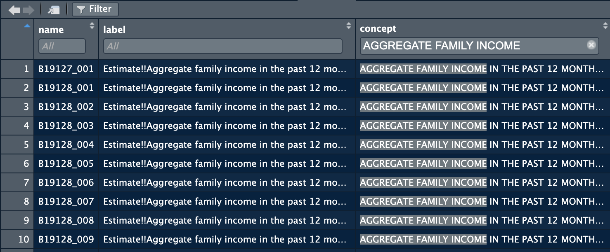

# Data {#data}

```{r include=FALSE}
library(here)
```

This chapter explains how to deal with different types of data within R, as well as how to clean, manipulate, and save data. When we are dealing with data we will be using the object of a data frame to save the data within the temporary memory of R itself (shown in the environment). This chapter uses the packages `dplyr`, `forcats`, `tibble`, `readr`, and `lubridate`, which are all contained within the tidyverse. Additional packages outside of the tidyverse and mentioned as they are used. The installation and calling of the `tidyverse` is demonstrated in the code chunk below:

```{r Call Tidyverse}
library(tidyverse)
```
The output from calling the tidyverse shows all of the different packages it loads into R at once and their most recent version. The core packages comprise a powerful suite of tools for importing, wrangling, and visualizing data. 

## Data Frames {#data_frames}

Within R itself, a typed data frame can be created in two different ways: using the `tibble()` or `tribble()` functions. Both functions do exactly the same thing using different syntax. The `tibble()` function uses the format `row = c(), row2 = c()`. The `tribble()` function uses a vertical format, with `~` denoting the row names. An example of how to the `tibble()` function is given in the code chunk below:

```{r Tibbles}
# the tibble function joins either manually set or referenced vectors of the same length into a data frame 
(data_frame <- tibble(row = c(1,2,3,4,5,6,7,8,9,10), # row_name = vector(length 10)
                     color = c('red', 'blue', 'yellow', 'green', 'purple', 'orange', 'magenta', 'red', 'purple', 'orange'), 
                     category = c('warm', 'cold', 'warm', 'cold', 'cold', 'warm', 'warm', 'warm', 'cold', 'warm'),
                     boolean = c(TRUE, TRUE, FALSE, TRUE, FALSE, TRUE, FALSE, FALSE, TRUE, TRUE))) 
```

Underneath the row name in `<>` is the data type of the column. `<dbl>` refers to double, `<chr>` refers to character, and `<lgl>` refers to logical. `<dbl>` is the standard data type for numbers and `<chr>` is the standard data type for text in R. `<lgl>` refers to a TRUE or FALSE value, usually called a Boolean in computer science. `<int>`, referring to integers, is another common data type. The rows must be the same length for the `tibble()` or `tribble()` function to run. Each row here has a length of 10. The function is surrounded in parentheses so the output prints. The code chunk below demonstrates how to use the `tribble()` function:

```{r Tribbles}
# the tribble identifies the column name on the first line with the ~ symbol
(data_frame2 <- tribble(~row, ~row2,
                       1,2, #subsequent rows going across are inputted underneath
                       3,4,
                       5,6,
                       7,8 )) # this provides an alternative method to hand entering these 
```

It is important to make sure each column is the intended data type. Functions (especially mathematical ones) often require a certain data type as an input.

### Date Time Objects {#date_time}

There is a special data type for dates and times available through the `lubridate` package. This package is automatically included in the tidyverse. There are three different data types associated with dates/times: a date data type signifying the day, month, and year (`<date>`); a time data type signifying the time within a day (`<time>`); and a date time which includes both (`<dttm>`).  The code chunk below demonstrates how to use the `make_datetime()` function to create date time objects. Using this data type ensures that graphs over time are produced properly using ggplot2. 

```{r Date Time Objects}
make_datetime(year = 2020, month = 11, day = 25)
```

Often, one of the hardest parts of working with a new data set is correctly changing however they keep the date/time into a date time object. The lubridate package is able to create these objects with a variety of input formats, making this process much easier. The code chunk below demonstrates different methods of creating `<dttm>` objects. This is done through the `parse_date_time(x, orders)` function. The `orders` argument tells the function what format your date is in. A full list of different possible `orders` is available in the documentation for the function. 

```{r Create with parse_date_time()}
parse_date_time('2017-01-02', orders = "ymd") #year month day orders
parse_date_time("01/02/2017", orders = "mdy", tz = "UTC") # month day year orders
# can specify a time zone as well
parse_date_time("2 Jan 2017 10:00:00 PM", orders = "dmy_HMS") #year month day_hour minute second
# this function can also read full text and abbreviations
```

One of the other really useful parts of lubridate date/time objects is the ability to refer to different components of a date time object. If you have a complete date time object, `year(date_time)` returns the year, `month(date_time)` returns the month, `mday(date_time)` returns the day of the month, `wday(date_time)` returns the day of the week, and the same for `hour(date_time)`, `minute(date_time)`, and `second(date_time)`. This will be used further in [Chapter 3](#data_viz) in conjunction with visualizing time series. 

```{r Call Date Attributes}
(today <- now())
year(today)
month(today)
mday(today)
wday(today)
wday(today, label=TRUE) # this returns a factor ordering the days of the week properly
hour(today)
minute(today)
second(today)
```

For more in-depth information and examples concerning lubridate refer to the [Dates and Times chapter](https://r4ds.had.co.nz/dates-and-times.html) of *R for Data Science*. [@r4ds] Additionally, looking at the documentation of the package is always helpful. 

### Factors {#factors}

Factors are a specialized data type meant to deal with ordered categorical variables. Factors are available as part of the `forcats` package. This data type best applies to a character variable that has a specified order, such as months in a year.[@r4ds] To convert a simple string variable into a factor you must use the `factor()` function. The code chunk below shows an example of converting a character vector to a factor. The difference can be seen when the factor and character vectors are sorted. Factors are most useful within data frames. They give R a roadmap of how to value categorical variables properly, making graphing, filtering, and general analysis easier.

```{r Create Factors}
mon <- c("Mar", "Apr", "Dec", "Feb", "Nov", "Jun", "Aug", "Jan", "Oct", "May", "Jul", "Sep")
factor <- factor(mon, levels = c("Jan", "Feb", "Mar", "Apr", "May", "Jun", 
  "Jul", "Aug", "Sep", "Oct", "Nov", "Dec"))
sort(mon) # this output does not have any ordering so it does not sort properly
sort(factor) # this output has the ordering for the months saved in the levels parameter
```

For a more in-depth explanation of factors, refer to [Chapter 15: Factors](https://r4ds.had.co.nz/factors.html) of *R for Data Science*. [@r4ds]

### Subsetting Data Frames

When working with data frames, such as `data_frame2` above, you may not want to reference the entire data frame. Often it is useful to just reference a column or element from a data frame. There are two main ways to do this. A column can be referenced by the name of the column using the following format: `data_frame$col_name`. The result is a vector containing the elements in the specified column. This is demonstrated in the code chunk below using `data_frame2`. 

```{r Reference Row with $}
data_frame2
data_frame2$row
```

While that is the simplest way to reference a column, it is also possible to reference a column or element within a column through its position. This can be done through the following general syntax: `data_frame[[col_index]][[row_index]]` or `data_frame[col_index, row_index]`. The syntax with the double brackets returns the element in its own data type, stripping it of its status as a data frame. Using the second syntax keeps its format as a tibble. The code chunk below demonstrates how to use both with `data_frame2`.

```{r Reference Row by Index}
data_frame2
data_frame2[[1]]
data_frame2[[1]][[1]]
data_frame2[1]
data_frame2[1,1]
```

### Displaying Data Frames in Markdown

The default format for displaying data frames in a final output is very limited. As seen in the example below, it prints it in machine output and does not display all rows if the data frame is too big. 

```{r Base Output}
data_frame
```

To create a more professional output for data frames, we use the `gt()` function from the `gt` package.

```{r gt}
library(gt)
gt(data_frame)
```

The output is much more visually appealing and highly customizable. For example, the `tab_header()` function allows you to add a title and subtitle, as demonstrated below.

```{r add gt header}
gt(data_frame) |> tab_header(title = "Data Title", subtitle = "More Information") # refer to piping operators
```

For more information on how to further customize tables using the functions available in `gt`, refer to the documentation [here](https://gt.rstudio.com). This package is structured similarly to `ggplot2`, so I recommend reading [Chapter 3](#data_viz) and then exploring the customization options this package has to offer. 

### Reference Saved Values in Markdown

When creating a markdown document for final submission, you will have to submit statistics you generated through your analysis from saved data frames and discuss them within the text of your R markdown document. To avoid errors with copying numbers, I recommend referencing the saved values directly so R markdown exactly replicates them without error. This can be done through the syntax "r value_name" surrounded by backwards apostrophes. It is also possible to run functions within inline code:
"r round(value_name, digits = 5)". Refer to the bottom left of the first page of the R markdown cheat sheet for further explanation and examples. 

## Importing Data {#importing}

Importing data is an important skill. Data comes in a variety of formats which you must transfer into a data frame format to use with R. One option is to hand-type the data into the `tibble` or `tribble` function, but this is very time consuming. It is only easiest to use these functions with small data sets or a data frame you want to display as a table.

### .csv Files {#csv}
Most often, data you encounter will be available in the .csv format (comma-separated-values). The `readr` package in the tidyverse provides the function, `read_csv()` for reading .csv files into a data frame. An example of how to use the `read_csv()` function is given in the chunk below:

```{r Import CSV}
(data <- read_csv(here("sample.csv")))
# this reads a csv detailing monthly liquor sales data
```

The sample.csv file is from *Introduction to Time Series Analysis and Forecasting*.[@forecasting]

### Microsoft Excel Files {#excel_import}

Excel has changed the way they save their files over time, leading to a variety of formats for excel files (e.g. .xls, .xlsx). Excel files can always be saved as .csv files within excel and then read as a .csv file into R. If you want to directly read the excel file, the `readxl` package offers the ability to read an excel file directly into a data frame through the `read_excel(file_name)` function. This function can read almost any form of excel file, regardless of what generation the file type is. The code chunk below shows an example of how to do this. Note: to just use the file name the file must be in the current working directory (by default this is the project folder).

```{r Import Excel}
library(readxl)
read_excel("sample.xlsx")
```

If the excel file has multiple sheets, the `sheet =` parameter allows you to select the sheet by setting it equal to the name of the sheet (make sure to put the name in quotes so it is a string). If the excel file has blank lines at the beginning of the file you can use the `skip = ` parameter to skip lines before it starts to read it. This is often necessary to ensure the .csv file correctly reads into a data frame. 

Excel has a very useful feature where it can read tables from pictures or screenshots of textbooks. This feature is found in the data tab of the top bar of excel and identified in the screenshot below. Simply select the file of a picture of the table and excel will try to import it. It isn't perfect but often get most of it right. Always check the data for errors when using this, it still saves a ton of time. 



### RDS Files {#rds}

.RDS files are meant for use in R and are a good way to save and read data frames. They quickly load into R and are the format I use to save my files when I call them in a separate R markdown document. The `read_rds()` function reads existing RDS files into a data frame. 

### Conclusion {#import_conclusion}

Almost any data you encounter will be in either one of these three formats or able to be converted into one of these formats using methods discussed above. Getting a data file into a data frame is the first step in analyzing data and can sometimes be the most tedious if you are not able to troubleshoot the process effectively. Always check you data!

## Saving Files {#saving}

Saving data frames allows you to save a snapshot of the data as you are going through your analysis. This can be useful after cleaning data. Often you will not need all the data in a data set or will have to alter the data. In [the next section](#cleaning_data), I discuss what clean data is and how to clean your data using the tools of the tidyverse. It is still important to preserve the original data as you received it for reference later on and to prevent deletion of data that you are unable to recover. By having the original file saved, you are always able to go back and retrace your steps from the original formatting to the clean data. 

### Saving Data Frames {#save_data_frames}

Saving data frames can be very useful to reference your data set in the desired format, as well as for saving tables for display in your final document. I recommend saving data frames as RDS files, as they are the easiest for R to quickly read and allow you to display the results in whatever format you wish. In the code chunk below, I create a sample data frame called `object` and then use the `saveRDS()` function to save the file. 

```{r Save Tibble}
# This creates a sample data frame to save as an RDS file
object <- tibble(
  a = c(1,2,3,4,5),
  b = c('a', 'b', 'c', 'd', 'e')
)

saveRDS(object, file = "file_name.rds") # the first parameter is the object you want to save
# in the file name it is important to end it with .rds so the computer knows what type of file it is
```

To reload these files into R, or call them in another document, use the `readRDS()` as shown below:

```{r Read Saved RDS}
readRDS("file_name.rds")
```

### Saving Other File Types {#save_misc}

There are a variety of objects you may want to save in your code for later reference, either in a written work or another document. Saving visualizations as .png files will be covered in [Chapter 3](#save_viz). For other types of objects that you may want to save, look on the internet for the best file type and function to use to save them. Always check that the saved file is as you intended it to be and that it can be read into the format you desire. 

## Cleaning Data and the Tidyverse {#cleaning_data}

What is clean data? For data to be clean there must be a clear pattern of organization to how the data is stored. This concept is also commonly referred to as tidy data. There are three general rules for making a data set tidy:[@r4ds]

* Each variable must have its own column
* Each observation must have its own row
* Each value must have its own cell

Table 1, shown below, is an example of a tidy data set. Each observation (pertaining to a country and a year) has its own row. Additionally, each variable has its own column. This table is included in the tidyverse as an example and used in *R for Data Science*.[@r4ds] 

```{r Table 1}
table1
```

```{r include=FALSE}
sample_table <- tibble(type = c("population", "cases", "population", "cases", "population", "cases"),
                country = c("Afghanistan", "Afghanistan", "Brazil", "Brazil","China", "China"),
                "1999" = c(19987071, 745, 172006362, 37737, 1272915272, 212258) ,
                "2000" = c(20595360, 2666, 174594898, 80488, 1280428583, 213766)
                )
```

Often, data when you receive it will not be in this format. The first step after successfully importing data is to clean it. The tidyverse offers functions that allow you to rearrange data frames into a format better suited for analysis and plotting. I will go through several examples of different common problems with data, and what functions are best to fix them.

### Pivoting Data {#pivoting}

First, we will discuss the two functions used for pivoting data. The code chunk below shows a sample data frame that has multiple issues. Instead of having a column for each variable, the variable "type" indicates the kind of value in that row. Columns 3 and 4, which both contain doubles, indicate the year of the values in those columns. These are examples of common problems with data organization. 

```{r Show Sample Table}
sample_table
```

These two functions in dplyr each solve different problems: 

* `pivot_longer()`
  + this adds rows making the data frame longer 
  + this corrects the issue with the columns pertaining to the year of the corresponding value
  + parameters: `pivot_longer(data, cols, names_to = "", values_to = "")`
    + data: data frame to pivot
    + cols: columns to pivot
    + names_to: name of new column containing the column names of the pivoted columns
    + values_to: name of new column containing the values of the pivoted columns

```{r Pivot Longer}
(longer_table <- pivot_longer(data = sample_table, cols = c(`1999`, `2000`), names_to = "year", values_to = "value"))
# the data = and cols = are not necessary as they are required parameters
```

* `pivot_wider()`
  + this adds columns making the data frame wider
  + this corrects the issue that each variable does not have its own column
  + parameters: `pivot_wider(data, names from = "", values_from = "")`
    + data: data frame to pivot
    + names_from: column whose values are the names of the new columns 
    + values_from: column whose values are the values of the new columns

```{r Pivot Wider}
# this pivots the data frame after the longer pivot above
pivot_wider(longer_table, names_from = type, values_from = value )
# note without an assignment operator (<-) this is not saved
```

For more information and examples about pivoting refer to the *Stanford Data Wrangling* chapter on [basic pivoting](https://dcl-wrangle.stanford.edu/pivot-basic.html) and the *R for Data Science* Chapter on [tidy data](https://r4ds.had.co.nz/tidy-data.html). [@stanford] [@r4ds]

### Creating New Variables {#new_vars}

When working with data you will want to create new variables. These can be numeric variables that combine values already present in the data or categorical variables that differentiate the values in some way. The `mutate()` function is used to create a new variable using the following syntax: `mutate(data, new_var = formula)`.

This first example, in the code chunk below, demonstrates how to make a new numeric variable using a formula consisting of two existing numeric variables. This creates a new column, `cases_per_cap`, that is the number of cases divided by the total population that year. The second new variable, `ln_pop`, demonstrates how to apply a function to an existing numeric variable to create a new variable. In this case the function is the natural log. 

```{r Mutate with Function}
mutate(table1, cases_per_cap = cases / population, ln_pop = log(population))
# on the left side of the equal sign is the name of the new variables
# on the right side is the new variable
```

You can use vectors outside of the data frame to create new variables, but must be careful when doing so. The vector must be the same length as the data frame. It is important to note that the first element will belong to the observation in the first row. You must make sure that you are assigning values to the correct observation, otherwise your data will become corrupted. The code chunk below shows an example of using a vector to create a new variable in table 1. 

```{r Mutate with Saved Vector}
new_var <- c(0.5, 2.1, 3.4, 0.3, 0.78, 1.64) # these values do not correspond to anything
mutate(table1, value = new_var) # the new var has a length of 6 so this works
# any other length would cause an error
```

This next example demonstrates how to use the `case_when()` function. `case_when()` is very useful when creating a new categorical variable based on already existing numeric variables. This function does not have any explicit parameters. Instead, there can be any number of logical statements (e.g. cases / population < 0.0001) with a corresponding `~`. `~` creates a formula in R. On the other side of the `~` is the value of the variable if the logical statement evaluates to `TRUE`. Make sure only one formula evaluates as `TRUE` for each observation. The code chunk below demonstrates the syntax for `case_when()`.

```{r Mutate Case When}
(new_table <- mutate(table1, cases_per_cap = case_when(cases / population < 0.0001 ~ "low",
                                     cases / population  >= 0.0001 & cases / population < 0.0003 ~ "medium",
                                     cases / population >= 0.0003 ~ "high")))
```

This example creates a new variable that designates the level of cases per capita as low, medium, or high. The new variable is a string instead of numeric. This variable is perfect for using the factor data type, as it has inherent ordered levels. The code chunk below demonstrates how to turn this variable into a factor. When using mutate, if you set something equal to a variable name already in use, it will overwrite that variable. 

```{r Mutate to Create Factor}
mutate(new_table, cases_per_cap = factor(cases_per_cap, levels = c("low", "medium", "high")))
```

### Selecting Columns {#select}

In some cases, an imported data frame will have more variables than you need for your analysis. The `select(data, cols)` function allows you to choose columns to keep in a new data frame. The data parameter is the data frame to select columns from, and `cols` is the name of the columns to select. The code chunk below demonstrates how to use the select function using `table1` as an example. `select()` is very useful when cleaning data as it allows you to easily discard data you do not need. You should always keep an original copy of the data as you received it in case you need to re-do your work. Save a modified data frame with a different name containing only the variables you need for analysis.

```{r Select}
select(table1, country, year) # this returns only the country and year columns

# the everything function allows you to move the selected columns to the front 
# of the data frame, keeping all columns
select(table1, year, population, everything())
```

### Renaming Variables and Piping {#rename}

It is very important to make sure the names of the columns comply with the naming conventions of coding discussed in [Section 2.1](#projects) and clearly indicate the variable to someone else. Most data sets have a code book that lists each variable and what it represents, but these names sometimes do not effectively identify the variable without having to refer to the code book. To rename the columns in a data frame use the `rename()` function available with the tidyverse. The code chunk below demonstrates this using `table1`.

```{r Rename}
rename(table1, nation = country)
# the name you want to change the column to is on the left of the equal sign
# the current name of the column is on the right of the equal sign
```

Piping is an operator within R that allows the chaining of functions. It is a powerful tool that can be used with almost any function in the tidyverse. The output from the code before the pipe is inputted into the function immediately after it. I use the rename function as an example of how to use it. In the code chunk below, I use the rename function to change the names of two columns.

```{r Piping Intro}
#this can be done with multiple columns
table1 |>  # the extra line is unnecessary but improves the readability of your code
  rename(nation = country, pos_test = cases)
```

The piping operator allows me to use the output of `table1` as the data parameter for the next function, in this case the `rename()` function. The code chunk below demonstrates this by both pivoting and renaming `longer_table` using the piping operator. From this point forward, I will be using piping when demonstrating new concepts. 

```{r Piping with Pivot and Rename}
longer_table |>
  pivot_wider( names_from = type, values_from = value) |> 
  rename(pop = population, time = year)
```

### Filtering Data {#filtering}

Filtering allows you to look at the subset of a data frame. It keeps rows that match a conditional statement (covered in [Chapter 1](#logical_operators)). The syntax is as follows: `filter(data, condition)`. The code chunk below filters Table 1, restricting it to only data pertaining to Afghanistan. This demonstrates how it can be very useful when dealing with categorical variables. 

```{r Simple Filter}
table1 |>
  filter(country == "Afghanistan") # need to use a double equals sign for conditional expressions
# the match on the right side of the equals sign must be the same data type as the column referenced
```

It is also very useful when dealing with numeric variables as well. The code chunk below demonstrates simple and more complex numeric filters. Simple conditional statements can be combined using `&` (and) and `|` (or) operators. 

```{r And Or Filter}
table1 |> filter(population > 20000000) 
# only keeps rows where population is greater than twenty million
table1 |> filter(population < 20000000 | population > 1000000000)
# when using the | operator, if one or both of the conditionals evaluates to true,
# then the whole statement evaluates as true and the row is kept
table1 |> filter(country == "Afghanistan" & year == 2000)
# when using the & operator, both conditionals must be true for the whole
# statement to evaluate as true and the row is kept
```

The `filter()` function is wonderful for selecting subsets of data, but it does not allow you to reorder the rows according to a variable. For this we use the `arrange()` function. The basic syntax for `arrange()` is shown in the code chunk below. The first example shows the default ascending order the `arrange()` function uses.  The second example shows how to instead use descending order by wrapping the column in the `desc()` function. The third example demonstrates what happens when multiple variables are included in the `arrange()` function. The function arranges according to the first variable and then without violating the arrangement of the first variable arranges according to the second, and so on. The final two examples show how arrange deals with characters. The most important difference between `filter()` and `arrange()` is that `filter()` loses observations when `arrange()` keeps all observations but just reorders them. 

```{r Arrange}
table1 |> arrange(year) # by default it arranges year in ascending order
table1 |> arrange(desc(year)) # arranges year in descending order
table1 |> arrange(year, desc(population)) 
# first arranges by year (ascending) and then by population (descending)
table1 |> arrange(country) # arranges in alphabetical order
table1 |> arrange(desc(country)) # arranges in reverse alphabetical order
```

### Summarizing Data {#summarize}

The `summarize()` function allows the creation of summary tables of the data. These tables are a crucial element of analysis. The function can be called either through `summarize()` or `summarise()`. Both do the exact same thing. The code chunk below shows an example displaying the mean of population, the mean the number of cases, and a count of the number of observations that go into each statistic.

```{r Summarize}
table1 |> summarize(pop_mean = mean(population), mean(cases), count = n())
# count shows the number of rows using the n() function
```

A common problem is determining the unique values of a categorical variable. The code chunk below demonstrates how to do this using the `reframe()` and `unique()` functions. This method only works with categorical variables. An alternative way to do this is shown in the next section using the `group_by()` and `summarize()` functions. 

```{r Unique Obs}
table1 |> reframe(unique(country))
```

### Grouping Data {#group_by}

When dealing with data that has categorical variables, it makes sense to analyze the data in context of each group within the categorical variable. This can be done through the `group_by()` function. `group_by()` on its own does not have any affect. It must be combined with another function and only works on categorical variables. The code chunk below demonstrates how it can be applied to countries in table1. When used in conjunction, it groups all observations with the same country and gives stats for each country instead of the data in totality as shown above. This function has the additional benefit of showing all possible values for the country categorical variable when used in conjunction with `summarize()`.

```{r Group By}
table1 |>
  group_by(country) |>
  summarize(mean(cases))
```

### Merging Data {#merge}

Often, for analysis it will make sense to combine data from different sources to allow for a greater scope of analysis. This process is called merging data. To merge a data set with another one they must be relational. This is done through matching keys: variables that uniquely identify observations.[@r4ds] There are two types of keys:[@r4ds]

* primary key: uniquely identifies an observation in the original own data frame
* foreign key: uniquely identifies an observation in the data frame to merge

Keys are not mutually exclusive; a variable can be a primary and foreign key. If a data frame lacks a primary key, you may need to make one. This can be done using `mutate()` and `row_number()`: `mutate(data, unique_key = row_number())`.[@r4ds] This makes the row number into a variable uniquely identifying each observation. This is called a surrogate key.[@r4ds]

There are two common types of merges:[@r4ds]

* mutating joins: matches observations according to their keys and then adds new variables from the new data frame to the original one
* filtering joins: filter observations from a data frame based on if they have a match in the second data frame

There are other more advanced ways of merging data with complex filters that are not covered here. For information on those methods and a more complete explanation of this essential data science topic, refer to the *R for Data Science* chapter on [relational data](https://r4ds.had.co.nz/relational-data.html#mutating-joins). [@r4ds]

There are two types of mutating joins:[@r4ds]

* inner join - `inner_join(x, y, by = "key")`
  + matches pairs of observations whenever their keys are equal 
  + unmatched observations are not included in the result
* outer join
  + keeps all observations that appear in either one or both data sets
  + `left_join(x, y, by = "key")` keeps all of the observations in the original data (x)
  + `right_join(x, y, by = "key")` keeps all of the observations in the new data (y)
  + `full_join(x, y, by = "key")` keeps all observation in both tables

Below, I use four fictional data sets to demonstrate the mutating join functions discussed above.

```{r Merge Examples}
original <- tibble(key = c(1,2,3,4,5),
                   data = c("a", "b", "c", "d", "e"),
                   nums = c(100, 110, 120, 130, 140))
  
new <- tibble(new_key = c(2,3,4,6,7),
              new_data = c(10,30,24,53,67))

duplicate <- tibble(key = c(1,2,2,2,3,4,5),
                    data = c("May", "Jul", "Nov", "Aug", "Jun", "Feb", "Dec"))

multiple <- tibble(key = c(1,2,3,4,5),
                   data = c("a", "b", "c", "d", "e"),
                   values = c("Mon", "Tues", "Wed", "Thurs", "Fri"))
```

The first thing you may notice is that in `original` and `new`, the column that contains the key does not have the same name or values. To join these you can either first rename the key columns so they have the same name or use the syntax of the first example below. The subsequent examples demonstrate how to use the other types of join function. 

```{r Join Original and New}
# the piping operator fills in the x data parameter
original |> inner_join(new, by = c("key" = "new_key")) # syntax without renaming
# keeps only matching observations
new <- new |> rename(key = new_key)
original |> left_join(new, by = "key") 
# keeps all observations in original (x) data frame
original |> right_join(new, by = "key") 
# keeps all observations in new (y) data frame
original |> full_join(new, by = "key") # keeps all observations in both
# when there is not a corresponding observation in the match and the observation is kept, NA is used to fill it in as missing
```

If the `by = ` parameter is not specified, `by = NULL`. This means that the key will be all variables that the two data frames share in common. This is called a natural join. Most of the time it is good practice to specify the key or keys you want to use to prevent errors. You must always check the data after joining to make sure it is correct. 

The `duplicate` data frame and the code chunk below demonstrate what happens when there are multiple observations that correspond to the same key. Usually, only one of the data frames will contain observations with duplicate matching observations. If this is not the case, then it there most likely is an error in one of the data frames. 

```{r Join with Duplicate Cols}
original |> inner_join(duplicate, by = "key")
```

When a variable is mutated in from the new (y) data frame that has the same name as one in the original (x) data frame, the variables are denoted `data.x` and `data.y`. This is demonstrated in the code chunk above. 

Sometimes, one variable will not be able to uniquely identify observations as discussed previously. The `multiple` data frame and the example in the code chunk below demonstrate the syntax of using multiple variables to identify observations.  

```{r Join by Multiple Keys}
original |> inner_join(multiple, by = c("key", "data"))
```

### Working Example {#b.22}

This section's example is from Appendix B.22 of *Introduction to Time Series Analysis and Forecasting*.[@forecasting] In the code chunk below, I read in the data from an excel file and printed it. It is a univariate time series of Denmark's crude oil production (in thousands of tons).[@forecasting] I will use methods discussed across this section to clean this data set. 

```{r Read Oil Production}
(oil_production <- read_excel("oil_prod.xlsx", skip = 2))
```

The main issue with the data is that the columns indicate the month and each row contains many observations and represents a year. The indication of time must always be contained to one column and each row must only contain a single observation. Additionally, the textbook uses `--` instead of `NA` to indicate missing observations and the columns are different data types despite containing observations of the same numeric variable. When this data is cleaned it will be a data frame with two columns, one containing the time and the other containing the oil production. 

The first step is to change the data type of the columns that are not doubles (May to Dec). I use the `mutate_if(data, .predicate, .funs)` function for this. `mutate_if()` allows me to change all columns that are characters (`.predicate`) to doubles (`.funs`). Look up the documentation for the function for more information on conditional mutates and further examples. This process introduces missing values to the data, seen through the warning produced. 

```{r Mutate If}
(clean_oil_production <- mutate_if(oil_production, is.character, as.double))
```

Next, the data must be pivoted. In the code chunk below, I use `pivot_longer()` function to create a single column for all the oil production values and a new column indicating the month. 

```{r Pivot Longer Example}
(clean_oil_production <- pivot_longer(clean_oil_production, -(Year), names_to = "month", values_to = "oil_prod")) # -(Year) selects all columns except year
```

Next, I need to join the month and year into a single string variable that can be read by `parse_date_time()`. In the code chunk below, I use the `str_c()` function (from `stringr`) within `mutate()` to join the two separate `Year` and `month` variables. `stringr` is a package included in the tidyverse for manipulating strings. Below, I have included the cheat sheets for manipulating strings with `stringr` for reference.[@R-stringr] For more information about working with strings, refer to the [strings chapter](https://r4ds.had.co.nz/strings.html) of *R for Data Science*.[@r4ds]

```{r Combine Vars}
(clean_oil_production <- clean_oil_production |> 
   mutate(time = str_c(Year, month, sep = " "))) 
```





Now that I have a unified time variable in the form a string, I need to replace it with a date time object using `parse_date_time()`. 

```{r Make Date Time}
(clean_oil_production <- clean_oil_production |>
   mutate(time = parse_date_time(time, orders = "ym")))
```


Finally, I need to drop all missing values using the `drop_na()` function and select only the corrected `time` variable and the newly created `oil_prod` variable to create the final clean data set. 


```{r Drop NA and Select Cols}
(clean_oil_production <- clean_oil_production |>
  drop_na() |>
  select(time, oil_prod))
```

I separated these steps into different stages for clarity. These steps can be completed continuously using piping as demonstrated below:

```{r All in One}
read_excel("oil_prod.xlsx", skip = 2) |>
  mutate_if(is.character, as.double) |>
  pivot_longer(-(Year), names_to = "month", values_to = "oil_prod") |> 
  mutate(time = parse_date_time(str_c(Year, month, sep = " "), orders = "ym")) |>
  drop_na() |>
  select(time, oil_prod)
```

## Data Sources {#data_sources}

This section outlines refutable data sources that have a robust collection of variables. This makes them ideal for exploring your own interests in data analysis or for creating a project of your own. This is not a comprehensive list, but will allow you to access most data available on the internet and access a variety of refutable and significant economic variables. 

### Tidycensus {#tidycensus}

Tidycensus is an R package that allows users to easily access US census data. A complete explanation of Census data and how to use `tidycensus` is given in Kyle Walker's [*Analyzing US Census Data: Methods, Maps, and Models in R*](https://walker-data.com/census-r/index.html).[@census] Walker provides a comprehensive and updated review of how to use Census data with R. `tidycensus` is an example of a package that interacts with an API (Application Programming Interface). APIs are amazing tools for getting access to underlying data on the internet from a wide variety of sources. For more information on APIs refer [this chapter](https://dcl-wrangle.stanford.edu/api-basics.html) from Stanford's *Data Wrangling*.[@stanford] 

```{r Call Tidycensus Package}
library(tidycensus)
```

Tidycensus is an example of a R package that is a wrapper for an API, making the process of obtaining data easier.[@stanford] The census has a variety of APIs available, but the ones most applicable to your work are:

* Decennial Census
  + Consists of the data from the survey sent to each U.S. household every 10 years, beginning in 1790 [@stanford]
  + Until the 2000, the decennial census consisted of a short form, which every household filled out, and a long form, a long form version with additional questions received by 1 in 6 Americans[@census]
  + Most accurate population data, but only available every 10 years
    + useful if a census year lines up with the time frame of your data
    + occurs in years ending in 0 (e.g 1990, 2000)
* the American Community Survey (ACS)
  + After 2000, the long form census became the ACS and was administered every year to a sample of 3.5 million households[@stanford]
  + Consists of samples every year or every five years
    + One year estimates are more current but have a larger margin of error, making five year estimates more useful[@stanford]
  + includes a wide variety of variables on social, economic, housing, and demographic aspects
    + very good data on racial breakdown
* the Population Estimates Program (PEP)
  + Population estimates for non-decennial census years using decennial census data as well as birth, death, and migration rates[@census]
  + Also allows access to indicator variables used in estimation
  + Uses more accurate techniques for population estimation than ACS population estimates[@stanford]
  
Before using Tidycensus you need to get a Census Bureau API key and activate it. This can be done by completing these steps:[@census]

1. Request a key [here](https://api.census.gov/data/key_signup.html)
  + You will receive an email with they key
2. Run `census_api_key("YOUR KEY GOES HERE", install = TRUE)`
  + replace `YOUR_KEY_GOES_HERE` with your Census key from step 1
3. Restart R (*Ctrl/Cmd + Shift +F10*)

These steps only need to be completed once. 

The first step to retrieving data is to select the variables you want using the `load_variables(year, dataset = )` function. The options for the `year` and `dataset` parameters are outlined below:[@census]

- Decennial Census
  + `dataset = `
    + `"sf1"`:  short form census
      + available for 2000 and 2010
    + `"sf2"`: range of population and housing unit characteristics
      + available for 2000 and 2010
    + `"sf3"` and `"sf4"`: long form census data on detailed demographic information such as income and occupation
      + available for 1790 to 2000, every 10 years
    + note portions of the 2020 census data are available 
      + this is only available through `load_variables(year = 2020, dataset = "pl")`
- ACS
  + `dataset = `
    + `"acs5"`: 5 year ACS
      + `year` refers to the end-year of the sample period
        + e.g. `year = 2019` refers to the 2015 through 2019 sample
      + ACS end-years 2009 to 2019 supported
    + `"acs1"`: 1 year ACS
      + ACS end-years 2005 to 2021 supported
- PEP
  + the PEP estimates are not available through the `load_variables()` function
  + instead you use the `get_estimates()` function
    + the entire data set is far too large to download, so you must use parameters to download smaller subsets
    + the use of this function is covered in the section below covering retrieving variables

The `load_variables()` function returns a tibble with three variables:

- `name`: the variable code
- `label`: a description of the variable
- `concpet`: a broader categorization

```{r Load Vars}
(vars <- load_variables(year = 2021, dataset = "acs1"))
```

This tibble allows you to select the desired variables from the selected data set. These variables are coded so it is important to make a list of the desired variables codes for retrieving the actual data. The sheer number of variables is overwhelming, so it is important to be able to narrow down to what you want through filtering. I have found the most success by first filtering by concept and then looking at the individual label. It is easiest to view the data frame from the R environment and filter through the button in the top left of the window. The picture below shows the results of filtering for aggregate family income from the 1-year ACS data set from 2021.



After selecting the desired variables, copy down the variable codes shown in the name column. The best way to do this is to save them into a vector, as demonstrated below. This allows you to just reference that vector in the variables argument of the retrieval function. The function used to get the data depends on the type of data you want:[@census]

- decennial census 
  + use `get_decennial(geography, variables = , year = )`
  + `geography = ` refers to the geographical unit of each observation
    + lowest level is `"tract"`, largest level is `"us"`
    + a full list of the options is available [here](https://walker-data.com/census-r/an-introduction-to-tidycensus.html#geography-and-variables-in-tidycensus)[@census]
  + `variables = ` refers to the variables to get
    + set this equal to the vector containing the names of desired variables
  + `year = ` refers to the sample end-year
- ACS 
  + use `get_acs(geography, variables = , year = , survey =)`
    + identical parameters are the same as above
    + `survey = ` refers to the acs survey you want
      + the default is `"acs5"`
      + other option is `"acs1"`
- PEP 
  + use `get_estimates(geography = , product = , year = , breakdown = , breakdown_labels = )`
    + identical parameters are the same as above
    + `product = ` refers to the set of variables to get
      + the options are `"population"`, `"components"`, `"housing"`, `"characteristics"`
    + `breakdown = ` allows you to break down the variables by different categories
      + the options are `"AGEGROUP"`, `"RACE"`, `"SEX"`, or `"HISP"`
      + when using `breakdown = ` it is best to set `breakdown_labels = TRUE` so the breakdown differences are included 
      
In the code chunk below I demonstrate how to create a variable vector and retrieve the variables with the `get_acs()` function. 

```{r Get ACS}
variables <- c("B01001_026", "B01001_002") # can put any number of variables in this vector
(acs_data <- get_acs(geography = "state", variables = variables, year = 2021, survey = "acs1"))
```

One thing to note about the census data is that it often comes in a form where it needs to be pivoted. Below, I demonstrate how to pivot this data into a clean form better suited for analysis and visualization:

```{r}
acs_data |>
  pivot_wider(names_from = c(variable), values_from = c(estimate, moe)) |>
  rename(male_pop = estimate_B01001_002, female_pop = estimate_B01001_026, male_pop_moe = moe_B01001_002, female_pop_moe = moe_B01001_026)
```

### IPUMS {#ipums}

IPUMS is a collection of social and economic data readily available on the internet. Their data sets aggregate data across different US government agencies and international data sources, including census data, the National Science Foundation, the Bureau of Labor Statistics, the Center for Disease Control, and the Food and Drug Administration. They also offer international, health, and higher education focused data sets. This allows access to census data for years that are not available in the tidycensus package. To get data you select the variable and the sample (source and time) into a cart and download the data as a .csv file on their [website](https://www.ipums.org).

### Google Trends {#gtrends}

Google Trends is a website that allows you to access data on the number of times a term was searched on Google by region and time period. This data can be incredibly useful in regressions and can be indicative of what is on people's mind at a given time. [This link](https://dgarcia-eu.github.io/SocialDataScience/1_Introduction/017_gtrendsR/gtrendsR.html) provides a guide on how to access this data either in the format of a CSV or directly within R through the `gtrendsR` package.[@R-gtrendsR]

### Scraping {#scraping}

Sometimes you are able to look at data on the internet, but it is not available for download. Scraping is the process by which you are able to access the data you can see through the html code of the website. Not all websites are able to be scraped easily, but many are. Scraping is a very useful skill in the world of data science. 

In R, scraping can be done through the `rvest` package. This is covered extensively [here](https://dcl-wrangle.stanford.edu/rvest.html) in the Stanford Data Wrangling book.[@stanford] This is a very useful tool and is considered to be an entire branch of data science. 

## Conclusion {#data_conclusion}

This chapter provides a comprehensive overview of data. By this point, using the skills above, you should be able to read almost any form of data into a data frame within R, manipulate and clean data, and get data from the variety of recommended data sources or through scraping. These skills will give you a concrete foundation for data wrangling. This book is meant to give a functional overview of these topics while referencing resources that provide more information. Do not hesitate to look into [*R for Data Science*](https://r4ds.had.co.nz/index.html), [*Stanford's Data Wrangling*](https://dcl-wrangle.stanford.edu), and [*Analyzing US Census Data*](https://walker-data.com/census-r/index.html). These resources provide more in-depth explanations into these topics. 
