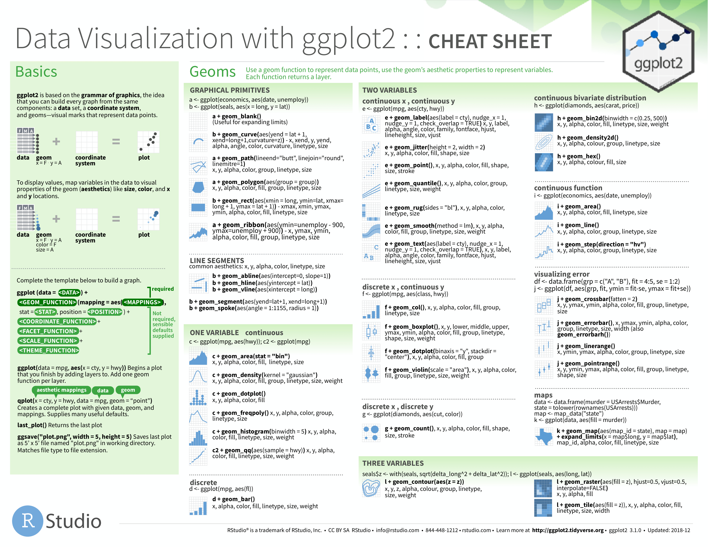
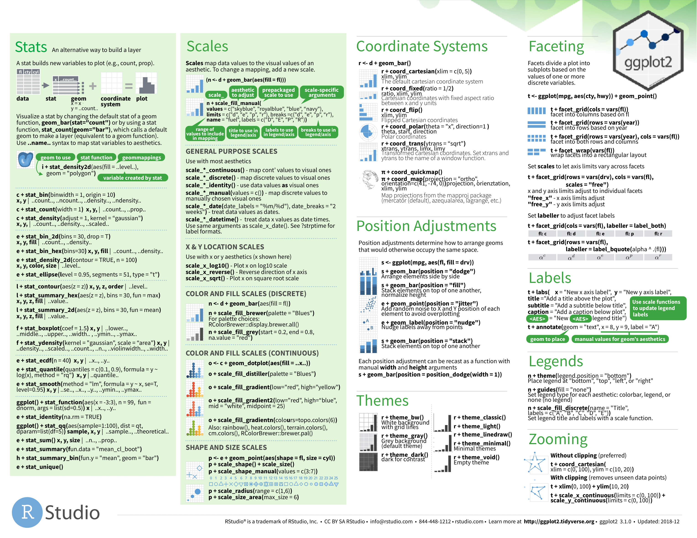

# Data Vizualization

In this chapter I will cover how to visualize data through `ggplot2`, a package included in the tidyverse. `ggplot2` provides a few distinct advantages. It is integrated into the tidyverse, allowing it to interact with data frames (tibbles) in meaningful ways to produce better looking and more customizable graphs using less code. It also uses a layered format of individual components, allowing multiple visualizations to be combined and allowing for easy modification of different aspects of visualization. This will be discussed in greater detail in subsequent sections. 

For work in this section we will be using a couple different packages. As always, we will use the `tidyverse` package, which contains `ggplot2`, the focus of this chapter. Additionally we will use `nycflights13`, a package that provides sample data to work with as we learn the tools available through `ggplot2`. 

```{r}
library(tidyverse)
library(nycflights13)
```

From `nycflights13` contains a variety of data sets pertaining to flights departing New York City in 2013. The code chunk below shows the two most prominent ones. 

```{r}
flights
weather
planes
```

`ggplot2` includes data sets to work with within the package as well. These data sets are show in the code chunk below. 

```{r}
diamonds
mpg
economics
```


This chapter is meant to serve as an introduction and guide to how to produce effective graphics for tidy data. I will link more comprehensive resources that go into further depth about the grammar of graphics and the intricacies of ggplot2. This should provide a comprehensive guide of the steps required to produce visualizations, as well as an overview of the foundational theory of effective graphics. 

## The Grammar of Graphics

`ggplot2` uses the theoretical framework called the grammar of graphics as the basis for its organization. Within this framework, there are three essential components to a graphic: [@modern_dive]

- `data`: the clean data containing the variable of interest
- `geom`: the type of geometric object in the plot 
  + e.g. line, point, bar, box
- `aes`: aesthetic attributes of the geometric object
  + e.g. x/y variables, color, shape, size
  + can be mapped (coordinated) to variables

For our first plot we will plot the `displ` and `hwy` variables. The code chunk below demonstrates the most basic syntax for producing a graphic using ggplot.[@ggplot2]

```{r}
(example1 <- ggplot(data = mpg, aes(x = displ, y = hwy)) + # data =, x =, and y = are not required
  geom_point())
```

In this plot `displ` refers to engine displacement (in liters), and `hwy` refers to highway miles per gallon. It is always crucial to know what each variable you are working with refers to. If you are unsure, check the code book for your data set. For the data sets we are working with in this chapter, their code books can be found in the documentation. In terms of the grammar discussed above, the `data` is `mpg`, the `geom` is points (designated by adding the `+ geom_point()`), and the `aes` refers to the variables assigned to each axis within `aes()` in the first line. I saved this plot as `example1` and put parentheses around the whole statement so it would print. 

This is a very basic example of how to produce a rudimentary scatter plot. The code above consists of two distinct components. 

The first line tells ggplot the data frame the variables are stored in, and within `aes()` tells ggplot which variables go to each axis. This is the most basic component of each visualization, taking care of the `data` and `aes` features of the visualization. 

```{r}
ggplot(data = mpg, aes(x = displ, y = hwy))
```

After establishing the basic grid where the data will be visualized, the next step is to add layers. Our first example graph used the layer `geom_point()` to create a scatter plot. One of the most powerful features of `ggplot2` is its ability to add multiple layers over the same grid. Each layer will take the data and aesthetics assigned within `ggplot()`. The code chunk below demonstrates how to use multiple layers. Each one can be added using the following code template: `+ layer_function()`. Different types of layers will be covered in detail later in this chapter. 

```{r}
ggplot(data = mpg, aes(x = displ, y = hwy)) + 
  geom_point() + 
  geom_smooth() # the geom_smooth function adds a line of best fit with a confidence interval
# look at the documentation of geom_smooth to determine the method it uses to smooth
```

If you would like to vary these attributes between layers, only specify the data 
It is important to note that everything written within `ggplot()` applies to all the layers added subsequently. The code chunk below demonstrates how to create two different scatter plots of variables that share an x-axis but differ on the y-axis. To differentiate between the two different variables, you must assign each one a different color. To assign an attribute that is not mapped to an aesthetic (within `aes()`) place it afterwards as demonstrated below. The two different variables on the same axis must share a unit for this to make sense. 

```{r}
ggplot(data = mpg) + 
  geom_point(aes(x = displ, y = hwy), color = "black") + 
  geom_point(aes(x = displ, y = cty), color = "red")
```

The issue with the plot above is that it does not automatically generate a legend. While this demonstrates how geoms can be layered, there is a better way to do this covered in section 4.2.1 Color. 

## Aesthetics

The most basic aesthetic attributes included in just about every type of plot are the assignment of the axes. Some types of plots (e.g histogram) only require the x-axis. Other types of aesthetic attributes can be used to differentiate between observations based on categorical variables. 

The first important differentiation about aesthetics, alluded to earlier, is the difference between putting something within `aes()` and putting something behind it. When an attribute is within `aes()`, the computer assumes that you are referring to a variable within the data. When an attribute is after the aesthetics (e.g.`aes(), color = "blue"`), then it applies the aesthetic change to the whole layer without mapping it to a variable. The difference is demonstrated in the code chunk below using the `example1` scatter plot and in the examples dealing with different types of aesthetics.

```{r}
# when color is within aes(), the computer thinks "red" is a categorical variable and incorrectly makes a legend
ggplot(data = mpg) + 
  geom_point(aes(x = displ, y = hwy, color = "red"))

# when the color is after aes(), all points are colored red
ggplot(data = mpg) + 
  geom_point(aes(x = displ, y = hwy), color = "red")
```

The important point here is that everything within `aes()` corresponds to a variable, when everything afterwards modifies an attribute of the visualization in a fixed way. 

This section will cover the basic attributes of a scatter plot, through a variety of examples using the data sets mentioned at the beginning of the chapter. Each of these attributes has different visual aspects that make them better or worse for categorical or continuous variables. Replicating and modifying these examples is the best way to practice getting comfortable making visualizations. All examples in this section will modify the `example1` plot, which uses the mpg data set. 

### Color

Color is a powerful attribute that lends itself well to both categorical variables and continuous ones. When used outside of aesthetic mapping purposes, it can be used to create graphics that are more visually appealing. When trying to communicate information through color, make sure that the uninformed reader is able to easily differentiate between the different categorical variable or read the scale if the variable is continuous. Experimentation between using different attributes to represent a variable is the best way to find the clearest way to communicate meaning through aesthetics. 

Color is used to differentiates between different classes of car, a categorical variable. Importantly, each class of car is identifiable through the legend. 

```{r}
ggplot(data = mpg) + 
  geom_point(aes(x = displ, y = hwy, color = class))
```

This example uses scaled color to represent the continuous variable `cty`, referring to the city miles per gallon. Often, when there are many points in a scatter plot or a wide range of values represented by color, it can become unclear to the observer. Each visualization is unique and must be individually assessed in this respect. 

```{r}
ggplot(data = mpg) + 
  geom_point(aes(x = displ, y = hwy, color = cty))
```

Using the color aesthetic addresses the problem of layering geoms to manually set different colors above. Unfortunately, the `mpg` data set does not come in a format where this can be done. The code chunk below demonstrates how to modify the data using `pivot_longer()`, creating a single mpg variable where a new categorical variable designates if the mpg variable refers to highway or city. 

```{r}
mpg |>
  pivot_longer(c(hwy, cty), names_to = "mpg_type", values_to = "mpg") |>
  ggplot(aes(x=displ, y=mpg, color=mpg_type)) +
  geom_point()
```

### Shape

Shape is only useful when representing categorical variables. It can be used to represent a continuous variable, but only if that variable is simplified into a categorical variable that designates a level for the continuous variable containing the actual value (e.g. low, medium, high). 

The code chunk below shows an example of mapping shape to the drive train variable (drv) and changing the shape for look without mapping to a variable.

```{r}
# mapping shape to the class variable 
ggplot(data = mpg) + 
  geom_point(aes(x = displ, y = hwy, shape = drv))

# changing shape for look only
ggplot(data = mpg) + 
  geom_point(aes(x = displ, y = hwy), shape = 17)
```

For information of which shape corresponds to which number, when not using mapping, look at [this](https://r4ds.had.co.nz/data-visualisation.html#aesthetic-mappings) section of R for Data Science.[@r4ds]

### Size

Size can be used to designate categorical variables, but often it can be hard to differentiate between levels and overall it makes the graph less legible. I would recommend only using size with a continuous variable, as it lends itself well to meaningful visual comparisons on a continuous scale. The example below maps size to the city miles per gallon variable (cty) from mpg. 

```{r}
ggplot(data = mpg) + 
  geom_point(aes(x = displ, y = hwy, size = cty))
```

As demonstrated above, size can also be changed outside of `aes()` for all points. Often, in a graph that is hard to read, reducing the size can make it more legible. This can be observed in the faceting example below. 

### Shading

Shading can be changed through the `alpha` parameter. The first example below reproduces a plot using the same variables as the size example, except `cty` is mapped to alpha instead of size. The second examples uses the same variables as the first example from the color section, except it maps class to alpha instead of color. 

```{r}
# using alpha to map a continuous variable
ggplot(data = mpg) + 
  geom_point(aes(x = displ, y = hwy, alpha = cty))

# using alpha to map a categorical variable
ggplot(data = mpg) + 
  geom_point(aes(x = displ, y = hwy, alpha = class))
```

While shading can be mapped to a categorical variable, it is not recommended as it is better suited for continuous distinctions. 

## Faceting

Faceting tells the computer to create separate graphs around a categorical variable within the same geom. This cannot be used with continuous variables. This may sound like a mouthful, but refer to the example below for further clarity. Faceting can be a very powerful tool for observing differences between observations belonging to different categorical variables and in creating effective time series graphs (covered later). There are two function used to create facets: `facet_wrap()` and `facet_grid()`. `facet_wrap()` is used for faceting a single variable, while `facet_grid()` is used to facet using two variables.

```{r}
ggplot(data = mpg) + 
  geom_point(aes(x = displ, y = hwy)) +
  facet_wrap(~ class) # '~ variable' is crucial to the syntax of faceting 

ggplot(data = mpg) + 
  geom_point(aes(x = displ, y = hwy), size = 0.5) + # size is changed for legibility
  facet_grid(drv ~ class)  # in this case '~' separates the two variables you want to facet
```

This feature of `ggplot2` is very powerful as it allows a clear comparison of `hwy` and `displ` between different classes of cars, allowing trends within each category to be observed much more easily. This can be combined with other aesthetics to create visualizations that provide a great deal of information. Be cautious that you are not including too much information in one visualization. 

## Geoms: Types of Plots

This section will cover different types of applicable plots and how to use them in `ggplot2`. First, I will go over the five named graphs covered in Statistical Inference in Data Science: A Modern Dive into R and the Tidyverse.[@modern_dive] These graphs are scatter plots, line graphs, histograms, box plots, and bar charts. Within each of these sections, I will cover more unorthodox approaches to producing similar graphics. Many of these geoms can be combined to provide more information in each visualization as well. Each of these graphics has data which they are useful for; the best way to determine which one is best for your situation is experimentation.

### Scatter Plots

So far we have extensively covered scatter plots in the earlier examples. To create a scatter plot, we use the `geom_point()` function demonstrated in examples above. Scatter plots are useful for visualizing the relationship (covariance) between two numeric continuous variables. They can be used for categorical variables as well, but convey much less information.

```{r}
diamonds |> 
  ggplot(aes(x = carat, y = price)) +
  geom_point(size = 0.25)
```

I choose this example because it is a classic example of over-plotting.[@modern_dive] This means that there are too many points close together. In the plot above this is so extreme there appear to be large black masses in much of the graph. In the plot above, I adjusted the size to try and mitigate this, but it only provided a slight improvement. 

One possible solutions is to use the `alpha =` parameter to adjust the transparency of the points. This is demonstrated in the code chunk below. This helps slightly but there is still a large amount of congestion. 

```{r}
diamonds |> 
  ggplot(aes(x = carat, y = price)) +
  geom_point(alpha = 0.1, size = 0.25)
```

The other method for mitigating the overlap of our data points is to jitter them. This means that each point is slightly randomly moved. This needs to be done with caution. While it does not modify the data itself, randomly jittering the points can produce a misleading visualization. This can be done through using `geom_jitter()` instead of `geom_point()`.[@modern_dive] To specify how much jitter to add, you can use the `width = ` and `height = ` arguments.[@modern_dive] I do not recommend using this; it is never a light decision to modify data. If you do, make sure you note that they are jittered for legibility. 

An alternative way to deal with over-plotting is to use an alternative geom that visualizes the density through color. These geoms, `geom_bin2d()` and `geom_hex()` mitigate the overlap of points through binning the observations. The code chunk below demonstrates how to use these two examples using the carat and price variables in the previous examples.[@r4ds]

```{r}
diamonds |>
  ggplot(aes(x = carat, y = price)) + 
  geom_bin2d()

diamonds |>
  ggplot(aes(x = carat, y = price)) + 
  geom_hex()
```

### Line Graphs

When producing a visualization, the variable on the x-axis is usually called the explanatory variable and the variable on the y-axis is usually called the dependent variable. Line graphs inherently imply that the points are sequential because they are connected visually. Therefore, line graphs are usually used when the dependent variable (x-axis) is some unit of time. 

To create a line graph, instead of `geom_point()` use `geom_line()`. In the example below, I use the weather data frame from the `nycflights13` package. To restrict the number of observations, I only use the weather from January 2013. 

```{r}
weather |> 
  filter(month == 1) |>
  ggplot(aes(x = time_hour, y = temp)) + 
  geom_line()
```

This produces a line graph that appears to have too many observations for the scale of the x-axis (by day). There are a few ways to mitigate this. You could only use the temperature from a certain time each day. This reduces the number of observations included in the graph making it much more legible. Another possible solutions would be to calculate an average for each day and use that instead. Both solutions are demonstrated in the code chunk below. The graph of the average temperatures appears to produces a much better looking graph. This is where the data wrangling skills from the previous chapter really come in handy. 

```{r}
weather |> 
  filter(month == 1 & hour == 12) |>
  ggplot(aes(x = time_hour, y = temp)) + 
  geom_line()

weather |>
  filter(month == 1) |>
  group_by(day) |>
  summarize(avg_temp = mean(temp)) |> # need to rename mean temp to a proper name for coding
  ggplot(aes(x = day, y = avg_temp)) +
  geom_line()
```

### Histograms and Frequency Polygons

A histogram is a plot useful for visualizing the distribution of the variable. With a histogram there is only one variable of input, shown on the x-axis. That variable is cut up into bins. This means that all the observations are broken up as evenly as possible into a number of groups, specified through the parameter `bins = `. When `bins = ` is not specified, `ggplot2` defaults to 30 bins. The more bins you use, the more detail you can see in the distribution. The other way to set bins is to use the `binwidth = ` argument. This specifies the size of each bin and makes the appropriate number of bins based on the specified size. 

In a histogram the y-axis usually is the count of the observations that fit into the bin. The other way to visualize this is by using the density. This is a number between 0 and 1 that shows the percentage of observations that fit within each bin. In the code chunk below, I use the price variable from the `diamonds` data set to demonstrate the code to make a histogram using the default count stat with 100 bins and to make a histogram using density instead of count and a bin width of 100. The `geom_density()` function, in the second example, adds a line indicating the density in addition to the bars. 

```{r}
# histogram using the default count stat and bins = argument
diamonds |>
  ggplot(aes(x = price)) +
  geom_histogram(bins = 100)

# histogram using density instead of count and the bidwidth = argument
diamonds |>
  ggplot(aes(x = price, y = after_stat(density))) +
  geom_histogram(binwidth = 100) + 
  geom_density(color = "red") # adds the red line indicating the density
```

Frequency polygons are another useful way to show the distribution of a single variable. To create a frequency polygon in `ggplot2`, you use the `geom_freqpoly()` function. Often, when trying to observe the difference between the density of a variable among observations differentiated by a categorical variable, frequency polygons can offer a much better direct visual comparison of the unique distributions. In the code chunk below, I demonstrate how to make a simple frequency polygon using the same variable as above, and then use the cut variable to demonstrate how to use it to compare distributions between categories.[@r4ds]

```{r}
diamonds |>
  ggplot(aes(x = price)) +
  geom_freqpoly(bins = 100)

diamonds |>
  ggplot(aes(x = price, color = cut)) +
  geom_freqpoly(bins = 100)
```

### Box Plots

Box plots are another type of visualization that lends itself well to analyzing the covariance of observations of a variable across different categories. They are very useful for large data sets because each box plot looks the same regardless of the number of observations plotted. This feature is because box plots are all based off the standard five number summary of a variable: minimum, first quartile (25th percentile), median, third quartile (75th percentile), and maximum.[@modern_dive] To create a box plot, we use the `geom_boxplot()` function and use two different variables, one continuous and one categorical. Usually, the continuous variable is mapped to the y-axis and the categorical one is mapped to the x-axis. The code chunk below demonstrates the syntax for making a box plot using the same variables as the histogram example.

```{r}
diamonds |>
  ggplot(aes(x = cut, y = price)) + 
  geom_boxplot()
```

While the uniform look of box plots regardless of the number of observations can be an advantage, some analysis may require a visualization that is more sensitive to what points fall where. `geom_violin()` is a similar type of visualization that sacrifices the identification of outliers for a focus on where the observations fall. The code chunk below demonstrates this visualization using the same variables as the example above. 

```{r}
diamonds |>
  ggplot(aes(x = cut, y = price)) + 
  geom_violin()
```

### Bar Charts

Bar charts are most useful for visualizing the distribution of a categorical variable.[@modern_dive]  In `ggplot2`, the function for creating bar charts is `geom_bar()`. Notably, this function summarizes the data, automatically counting the number of observations in each category. If the data is already in the form of a summary table, you should use the `geom_col()` function and specify both a `x = ` and `y = ` parameter. The code chunk below demonstrates both how to use the `geom_bar()` function using the cut variable from the diamonds data set, and how to generate the correct summary table and then use the `geom_col()` function. Both methods produce the same output.  

```{r}
diamonds |>
  ggplot(aes(x = cut)) +
  geom_bar()

diamonds |>
  group_by(cut) |>
  summarize(count = n()) |>
  ggplot(aes(x = cut, y = count)) +
  geom_col()
```

The aesthetics of bar charts are also very useful for analyzing the covariance between two categorical variables. In the code chunk below, I generate the same graph using `geom_bar()` and map the `color = ` and `fill = ` aesthetics to the color variable in the diamonds data set. This allows for easy comparison of the number of observations that have a certain color between the different categories of cuts. 

```{r}
diamonds |>
  ggplot(aes(x = cut, color = color, fill = color)) +
  geom_bar()
```

Bar charts have an argument called position that allows you to change the layout of how each bar is arrange when another variable is used other than the one on the x-axis. The default position argument, shown above, is `position = "stack"`, meaning the different categories of color are stacked on top of each other. This can make it hard to visually compare the number of observations of the color categories in between cut categories. The first example below, using the `position = "fill"` argument changes the y-axis to a probability measure instead of count, allowing for direct comparison between categories. The second example uses the `position = "dodge"` argument, which unstacks the bars so the exact level of each colored bar can be directly compared. 

```{r}
diamonds |>
  ggplot(aes(x = cut, color = color, fill = color)) +
  geom_bar(position = "fill")

diamonds |>
  ggplot(aes(x = cut, color = color, fill = color)) +
  geom_bar(position = "dodge")
```

### Additional Geom Layers

For reference below I have included images of the `ggplot2` cheat sheet. This reference includes almost any possible geom you could want to use in creating a visualization. This resource is available online [here](https://github.com/rstudio/cheatsheets/blob/main/data-visualization.pdf).




One important note is to avoid pie charts! Research has shown that they often lead to misinterpretations of data.[@modern_dive] Visually it is very hard to compare one piece of the pie to another due to the arrangement. Often, bar charts are a much better tool for these types of visualizations. 

## Modifying Data and Axes

As discussed above, over-plotting is a common issue that can make well though-out graphs illegible. Faceting is one solution, but can lead to the individual facet graphs being to small to be of much use. In this section I will discuss other possible solutions to common over-plotting issues. 

### Filtering

This may seem a little obvious, but a common and useful solution is to simply plot less data through filtering. Filtering data is covered in section 3.3.5 Filtering Data. In the 4.4.2 Line Graphs section example, I use filtering to select only flights in January 2013. Piping is an important tool with these types of problems. Piping allows you to take a data frame, pipe it through any modifiers to wrangle it into the desired form, and then pipe it straight into `ggplot()`. This removes the intermediary step of saving a modified version of your data before you create a new graph. If you are using the modified for for multiple visualizations, it is worth it to save and then call it so you do not have to repeat code. An important part of data science is having a focused question. While looking at a very large data set in a meaningful way can be very important, when working with large data, always ask yourself if you need all the data you have to answer your question. 

### `xlim()` and `ylim()`

Another way to take data out of the picture or focus on a specific feature of a visualization is to modify the axes. This can be useful when talking about a specific feature of the data, and can also be done through filtering.

For this example, I will use data from `nycflights13`. The code chunk below demonstrates the process of combining the seats variable from the planes data frame with the flights data frame. Refer to the section 3.38 Merging Data for more information on the specifics of this. 

```{r}
(flight_size <- flights |> # notice I selected the key, tailnum, and desired var, seats from planes to join
  left_join(planes |> select(tailnum, seats), by = "tailnum")) |> # this prevents unwanted data in the new data frame
  select(month, day, distance, dep_delay, seats) # select only variable I will use in visualization
```

After combining the data frame, I created below a scatter plot of the departure delay (dep_delay) and flight distance (distance) all the planes that left NYC in January of 2013. In this scatter plot, I mapped the size aesthetic to the number of seats on the plane. The most obvious issue with this visualization is over-plotting. All of the points are clustered in the bottom left corner of the graph leaving a massive section of blank space.  

```{r}
(axes_example <- flight_size |>
  filter(month == 1 & day == 1) |>
  ggplot(aes(x = distance, y = dep_delay, size = seats)) +
  geom_point())
```

To mitigate this issue, I first modify the y-axis. I use the `ylim(min, max)` function for this. There does not appear to be any flights where dep_delay is greater than 400, so I limit the y axis from 0 to 400. The scale of the x-axis still appears to be causing over-plotting issues. 

```{r}
axes_example + ylim(0,400)
```

To limit the x-axis, I use the `xlim(min, max)` function. I choose to limit the x-axis to 3000, excluding one observations with a distance of 5000. The exclusion of data must always be noted, otherwise your visualization is misleading. In this case, it is such an extreme outlier and is only once observations so it has little effect on the visualization and is worth the added clarity. 

```{r}
axes_example + ylim(0,400) + xlim(0,3000)
```

This graph still suffers from a lack of clarity due to over-plotting but serves as a good example of how to experiment to find the best way to visualize data, while introducing these important functions. 

## Titles

One of the wonderful features of `ggplot2` is that it allows you change the titles from the variable names in the data. The names in the data, while clear and concise for coding purposes, often do not provide enough information for academic work. It is important that titles are clear to the uninformed reader. Always provide units for variable axis titles and specify the time frame of your data if applicable. The titles are added through `+ labs()`. This is demonstrated in the code chunk below. Look up the `labs()` function documentation for further options. 

```{r}
example1 + labs(title = "Scatter Plot of Highway Miles Per Gallon and Engine Size", x = "Engine Displacement (Liters)", y = "Highway Miles Per Gallon")
```

This example also demonstrates how to modify visualizations even after they are saved within R. In this example, I call `example1` above and use `+ labs()` to modify titles. This method can only add layers to a visualization, not modify existing ones.  

## Plotting Time Series

This section covers the unique difficulties of properly plotting time series data. Time series data is any data that has a sequence through time. For this section we will use the `economics` data set included with `ggplot2`. This data set is presented in the code chunk below. When dealing with time series data the first important feature of the data set to identify is the time interval between observations. These observations are taken on a monthly basis. The second important feature of a time series to identify is the span of the data in question. These data span from January of 1967 to April of 2015. 

```{r}
economics
```

It is crucially important that the variable indicating time is stored in a date object. Looking at the data frame above you can see that the `date` variable has the type `<date>`. This ensures that `ggplot2` correctly recognizes that each value stands for a point in time and treats them properly. It also allows you to reference different components of the date_time object using function available through the `lubridate` package (included in the tidyverse). 

In the code chunk below I plot the median duration of unemployment in weeks (`uempmed`) over time (`date`). When plotting time series, I prefer to use `geom_line()`, to visually show the connected nature of the points, and `geom_point()` to indicate where each individual observation falls. 

```{r}
economics |>
  ggplot(aes(x = date, y = uempmed)) +
  geom_point(size = 0.5) + 
  geom_line()
```

The span of this data set causes the observations to be slightly too closely clustered together. In the code chunk below, I restricted the observations to be from 1980 to 1989 to demonstrate the effectiveness of this method on a smaller time frame. Notice how I used the `year()` function on the date object, allowing me to filter by year. 

```{r}
economics |>
  filter(year(date) < 1990 & year(date) >= 1980) |>
  ggplot(aes(x = date, y = uempmed)) +
  geom_point(size = 0.5) + 
  geom_line()
```

Returning to the original example in this section, faceting is the best method to use to improve the clarity of the plot of the complete time series without restricting the observations plotted. This also allows the trend within each year to be easily compared as each year has its own plot. 

```{r}
economics |>
  ggplot(aes(x = month(date), y = uempmed)) +
  geom_point(size = 0.5) + 
  geom_line() + 
  facet_wrap(~year(date))
```

## Saving and Showing Graphics

For display, visualizations should be saved in the format of a .png. This format allows them to easily be reference in a separate document if desired. To save a visualization, you should use the `ggsave("filename", plot = )` function. In the code chunk below, I save the first plot I made in this chapter by referencing its name in the `plot = ` parameter. Crucially, the `filename = ` parameter must have quotation marks around it. If the `plot = ` parameter is not specified, then the function will automatically save the last plot you made. 

```{r}
ggsave("example1.png", plot = example1)
```

`ggsave()` can be used to save other file formats as well. Refer to the `ggsave()` documentation for more information on how to do that and working examples. 

## Conclusion

After reading this section, you should have a functional understanding of the grammar of graphics, the syntax of `ggplot2`, and how to make informative and functional data visualizations for basic statistics. Throughout this chapter, I combined resources from a variety of free, online resources. These resources go into greater detail on the technical side of these topics, and provide more working examples. The purpose of this chapter is to quickly give a foundation in the basics of these topics. If something does not make sense, or your you would like to know more do not hesitate to refer to these resources (available in references). 
