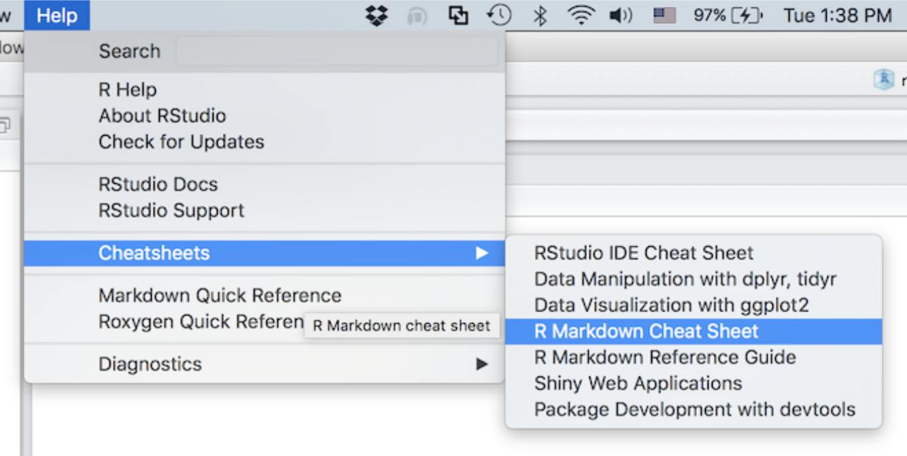
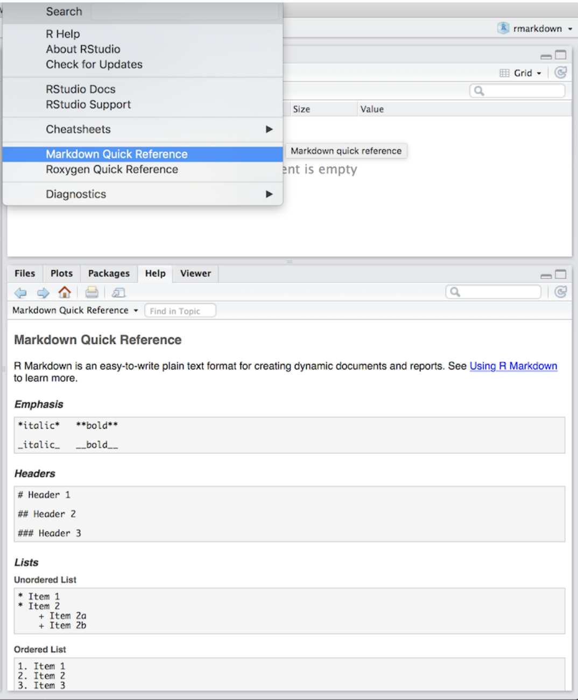

```{r include=FALSE}
# automatically create a bib database for R packages
knitr::write_bib(c(
  .packages(), 'bookdown', 'knitr', 'rmarkdown', 'tidyverse', 'here', 'leanr'
), 'packages.bib')
```

# Introduction {#intro}

These modules are here to present a succinct guide to using R, RStudio, and the R Markdown format for data manipulation, analysis, and visualization. This guide is meant for those who have little to no experience in R specifically or programming at all. My purpose in designing these modules is to provide a brief yet clear guide to learning the basics of these tools and how to apply them. Throughout, I will link resources to guides that provide more in-depth discussion and complete overview of the packages and code used. I have found a lot of value exploring these resources. Almost anything you could want to know about R is available on the internet. If you run into an issue, do not be hesitant to use forums such as [stack overflow](https://stackoverflow.com). Someone has most likely run into the same problem before. A simple google search will often do the trick. The best way to develop these skills is practice using R to create documents and do assignments. In my experience, I have found that R markdown offers more control of the documents that I am making and allows me to directly integrate the statistical work that I do with the assignments I submit. Aside from the wonderful PDF output features of R markdown (available through LATEX), R offers the ability to create web pages and publish in the html format on the internet. This format offers widgets, knits faster than the PDFs, and allows for user interaction with the data analysis if combined with R shiny to make dashboards. This entire guide was written in R using the bookdown package. These skills are very powerful and desirable in the professional world. 

Before starting this guide, I recommend working through Professor Andy Field's [guide](https://milton-the-cat.rocks/learnr/r/r_getting_started/#section-installing-r-and-rstudio).[@andy_field] I really like his recommendations for reorganizing the windows in R Studio to promote better workflow and how he highlights the ways to customize R Studio so it works best for you. Towards the end of the guide he covers topics that I will cover in more detail, outlining multiple methods. Most of the assignments you submit will be in the format of PDF, making it important that you download LATEX, the software used to produce these outputs. The different versions of this software for different computers can be found [here](https://www.latex-project.org/get/).

As you are working through your own work, it is impossible to remember all of the little things in 
R markdown's syntax or relevant to the specific package you are working with. RStudio has made a bunch of very helpful cheat sheets that outline the basic needed to write effective documents in markdown and much more. Those can be accessed through the help menu as seen in the picture below:

You are also able to pull up a list of markdown syntax within RStudio itself. This will appear in the help panel in the bottom right of your RStudio:


Aside from these great resources you can always use the help tab to search for the documentation of a function. Happy coding!

These are the packages needed for work in this book:

* here
  + great package for referencing file names and paths
* leanr 
  + enables tutorials
* tidyverse
  + package for data manipulation and objects
  + widely used and integrated with many other packages
* knitr 
  + tidy table output in both html and pdf
* tidycensus
  + package for accessing US census data and estimates through their API
  
